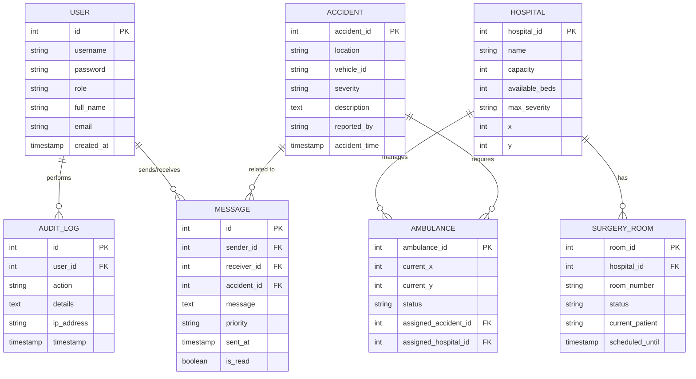

# AI Accident Detector & Ambulance Dispatcher - ER Model

This document provides the Entity Relationship (ER) model for the project's database schema.

## ER Diagram

## Entity Descriptions

### 1. User
Stores authentication and profile information for system users (Admin, Dispatcher, Operator, etc.).

### 2. Accident
Main record for reported accidents, including location, severity, and reporting details.

### 3. Hospital
Information about hospitals, their locations, and bed capacities.

### 4. Ambulance
Tracks the fleet of ambulances, their current positions, and their dispatch status relative to accidents and hospitals.

### 5. Message
Handles internal communication between different system roles, often related to specific accidents.

### 6. Audit Log
A security feature tracking user actions and system changes for accountability.

### 7. Surgery Room
Tracks the availability and status of operating rooms within hospitals.
