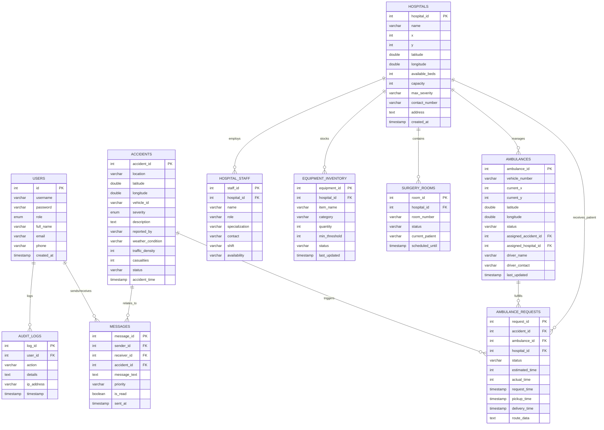

# Relational Schema - AI Accident Detector & Ambulance Dispatcher

This document details the relational schema for the project's database, including table structures, data types, and constraints.

## Visual Schema (ER Diagram)

## Table Specifications

### 1. USERS
| Attribute | Data Type | Constraints | Description |
| :--- | :--- | :--- | :--- |
| `id` | INT | PK, AUTO_INCREMENT | Unique user identifier |
| `username` | VARCHAR(50) | UNIQUE, NOT NULL | Login name |
| `password` | VARCHAR(255) | NOT NULL | Encrypted password |
| `role` | ENUM | ADMIN, DISPATCHER, etc. | System access level |
| `full_name` | VARCHAR(100) | | User's full name |
| `email` | VARCHAR(100) | | Email address |
| `phone` | VARCHAR(20) | | Contact number |
| `created_at` | TIMESTAMP | DEFAULT CURRENT_TIMESTAMP | Account creation time |

### 2. ACCIDENTS
| Attribute | Data Type | Constraints | Description |
| :--- | :--- | :--- | :--- |
| `accident_id` | INT | PK, AUTO_INCREMENT | Unique accident identifier |
| `location` | VARCHAR(255) | NOT NULL | Location description |
| `latitude` | DOUBLE | DEFAULT 0.0 | GPS Latitude |
| `longitude` | DOUBLE | DEFAULT 0.0 | GPS Longitude |
| `severity` | ENUM | Low, Medium, High, Critical | Urgency level |
| `status` | VARCHAR(50) | DEFAULT 'Reported' | Current lifecycle state |

### 3. AMBULANCES
| Attribute | Data Type | Constraints | Description |
| :--- | :--- | : :--- | :--- |
| `ambulance_id` | INT | PK, AUTO_INCREMENT | Unique ambulance identifier |
| `vehicle_number` | VARCHAR(50) | | License plate number |
| `status` | VARCHAR(50) | DEFAULT 'green' | Availability/Alert status |
| `assigned_accident_id` | INT | FK -> ACCIDENTS | Current task |
| `assigned_hospital_id`| INT | FK -> HOSPITALS | Home/Current base |

### 4. HOSPITALS
| Attribute | Data Type | Constraints | Description |
| :--- | :--- | :--- | :--- |
| `hospital_id` | INT | PK, AUTO_INCREMENT | Unique hospital identifier |
| `name` | VARCHAR(200) | NOT NULL | Hospital name |
| `available_beds` | INT | | Currently free beds |
| `capacity` | INT | | Total bed capacity |

### 5. AMBULANCE_REQUESTS
| Attribute | Data Type | Constraints | Description |
| :--- | :--- | :--- | :--- |
| `request_id` | INT | PK, AUTO_INCREMENT | Unique request identifier |
| `accident_id` | INT | FK -> ACCIDENTS | Linked accident |
| `ambulance_id` | INT | FK -> AMBULANCES | Assigned unit |
| `hospital_id` | INT | FK -> HOSPITALS | Destination hospital |
| `status` | VARCHAR(50) | | Pickup, In Transit, Delivered |
